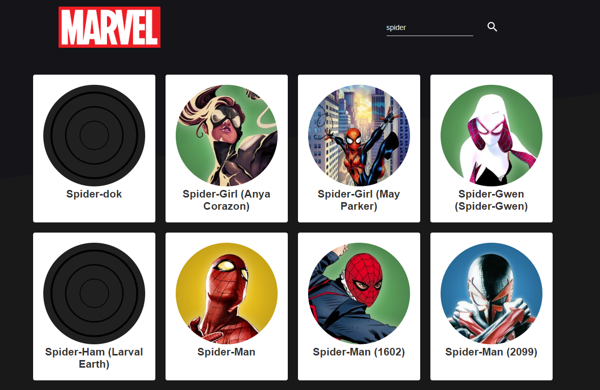

<h2 align="center">
  <p>Aplicação que lista personagens da marvel</p>
  <p align="center">
    
    
  </p>
</h2>

<h3 align="center">
  O projeto desenvolvido no módulo foi um e-commerce criado na web e o desafio proposto foi a criação da interface mobile do mesmo.
</h3>

  Funcionalidades:

  - API rest fictícia criada utilizando json server;
  - Utilização de Redux Saga para coordenação de actions e side effects;
  - Header configurado para navegação entre as telas utilizando a logomarca da "Rocketshoes" e o ícone da cestinha de compras;
  - Inclusão de produtos no carrinho com verificação de estoque e alerta se quantidade não estiver disponível;
  - Adição e subtração de itens já inclusos no carrinho;
  - Exclusão do produto do carrinho;
  - Cálculo de subtotais e total de acordo com as quantidades e preços dos produtos que estão no carrinho.

<blockquote align="center">“Acredite em você a cada passo”</blockquote>

### :heavy_check_mark: Configurações necessárias

-  [Git](https://git-scm.com)
-  [Node](https://nodejs.org/)
-  [Yarn](https://yarnpkg.com/)
-  Ambiente para desenvolvimento mobile configurado conforme sistema operacional utilizado

### :arrow_down_small: Clonando o repositório
Pelo terminal, acesse o diretório em que deseja ter o repositório clonado e execute o comando a seguir.
```bash
# clonando o repositório
git clone https://github.com/davifrancamaciel/marvel-heroes.git
```
### :computer: Iniciando o progeto
Pelo terminal, acesse o diretório marvel-heroes do repositório clonado e execute os seguintes comandos separadamente.
```bash
# instalando as dependências
yarn install

# iniciando a aplicação
yarn start
```


### :wrench: Tecnologias | Ferramentas | Recursos

-  [ReactJS](https://pt-br.reactjs.org/)
-  [React App](https://pt-br.reactjs.org/docs/create-a-new-react-app.html)
-  [ReactDOM](https://pt-br.reactjs.org/docs/react-dom.html)
-  [React Router DOM](https://www.npmjs.com/package/react-router-dom)
-  [React](https://pt-br.reactjs.org/)
-  [React Native](https://reactnative.dev/)
-  [React Toastify](https://github.com/fkhadra/react-toastify)
-  [ESlint](https://eslint.org/)
-  [Prettier](https://prettier.io/)
-  [Babel ESlint](https://github.com/babel/babel-eslint)
-  [Styled Components](https://styled-components.com/)
-  [Axios](https://github.com/axios/axios)
-  [React Redux](https://react-redux.js.org/)
-  [Redux](https://redux.js.org/)
-  [Redux Saga](https://redux-saga.js.org/)
-  [History](https://github.com/ReactTraining/history/tree/3f69f9e07b0a739419704cffc3b3563133281548)
